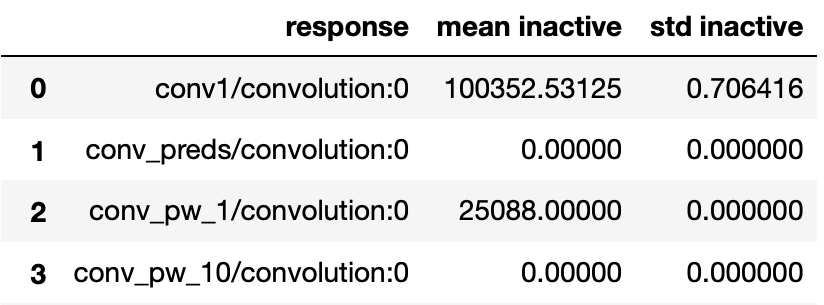

.. _how_to_introspect:

==========
Introspect
==========

**Introspection** is the examination of the activations of a neural network
as data passes through. Introspecting networks and data can help
improve an ML pipeline's efficiency, robustness, and fairness.

DeepView :class:`Introspectors <deepview.base.Introspector>` are the core algorithms of DeepView.
You can see all available introspectors on the following pages:

- :ref:`Data Introspectors <data_introspection>`
- :ref:`Network Introspectors <model_introspection>`

As noted previously, DeepView uses evaluation, and so
each :class:`Introspector <deepview.base.Introspector>` has an
:attr:`.introspect() <deepview.base.Introspector.introspect>` method which will trigger the
:class:`Producers <deepview.base.Producer>` to generate data and the
:func:`pipelines <deepview.base.pipeline>` to consume and process it. This is demonstrated in
the diagram below.

.. image:: ../img/arch_overview.gif
    :alt: An animated diagram illustrating the DeepView pipeline. A single batch at a time
          is fed through the entire pipeline, from Producer to Introspector.

Exploring Results
-----------------

To explore the result of an introspection,
DeepView's **network** introspectors (PFA, IUA) have a :code:`.show()` method built-in, that
can be run in a Jupyter notebook to view the results live.
For these show methods, the result of the :code:`.introspect()` call should be passed in
as the first argument.

For instance, an example for :ref:`IUA <inactive_units>`:

.. code-block:: python

   iua_result = IUA.introspect(producer, batch_size=64)  # introspect!

   # Show inactive unit analysis results (with default params)
   IUA.show(iua_result)

          inactive units.

|

The results of DeepView **data** introspectors can be visualized and explored in different manners.
If the data introspectors are run as part of the
:ref:`Dataset Report <dataset_report>`, the introspection results may be directly fed to and
explored interactively with the `Canvas Framework <https://github.com/satishlokkoju/deepview>`_ which is a part of DeepView ToolKit.
If the introspector is run outside of the :ref:`Dataset Report <dataset_report>`, the
:ref:`DeepView notebook examples <example_notebooks>` show one of many possible ways each result may
be visualized.

Best Practices
--------------

Preparing Inputs for Introspectors
~~~~~~~~~~~~~~~~~~~~~~~~~~~~~~~~~~
There are various ways in which DeepView introspection can be tailored for different use cases.
Here are some common things for users to think about:

- Which intermediate layer(s) to extract model responses from
- Whether to attach metadata to batches (e.g., labels and unique IDs),
  for instance to refer back to the original data samples with a unique identifier
- Whether to pool responses or reduce dimensionality before
  running model responses through the introspector

Selecting Model Responses
*************************

To use an introspector, typically certain layer(s) of the network model are used
rather that using the final outputs (or *predictions*). These layer names can be
provided as input, and thus requires finding the correct layer names. It's possible to
inspect a dictionary of responses with the
:meth:`response_infos <deepview.base.Model.response_infos>` method:

.. code-block:: python

   model = ... # load model here, e.g. with load_tf_model_from_path
   response_infos = model.response_infos

DeepView also provides a utility function for finding
input layers from a :class:`Model <deepview.base.Model>`

.. code-block:: python

   model = ... # load model here, e.g. with load_tf_model_from_path
   input_layers = model.input_layers
   input_layer_names = list(input_layers.keys())

.. _response_caching:

Caching responses from pipelines
~~~~~~~~~~~~~~~~~~~~~~~~~~~~~~~~

When running DeepView in a Jupyter notebook, a good rule of thumb is to
:class:`cache <deepview.processors.Cacher>`
(temporarily store on disk) responses at a point in the :ref:`pipeline <pipeline>` where
it doesn't make sense to re-run every time the pipeline is processed (e.g. via introspect).
This can be done by adding a :class:`Cacher <deepview.processors.Cacher>` as a
:class:`PipelineStage <deepview.base.PipelineStage>`. For instance:

.. code-block:: python

    from deepview_tensorflow import TFDatasetExamples, TFModelExamples
    from deepview.base import pipeline
    from deepview.introspectors import Familiarity
    from deepview.processors import ImageResizer, Cacher

    # Load data, model, and set up batch pipeline
    cifar10 = TFDatasetExamples.CIFAR10()
    mobilenet = TFModelExamples.MobileNet()
    response_producer = pipeline(
         cifar10,
         ImageResizer(pixel_format=ImageResizer.Format.HWC, size=(224, 224)),
         mobilenet()

         # Cache responses from MobileNet inference
         Cacher()
    )

In this code, the CIFAR10 dataset will only be pulled through the MobileNet
model **a single time,** regardless of how many times :code:`response_producer` is used later.
The ``response_producer`` can then be fed to various :ref:`introspectors <how_to_introspect>`
or perform post-processing by creating new :func:`pipelines <deepview.base.pipeline>`
using :code:`response_producer` as the :class:`producer <deepview.base.Producer>`. It is on the user
to decide if caching will use significant space on their machine, and if it is worth the speed-up.
For instance, caching a single model response per data sample (caching after model inference)
will take up less space than caching large video data samples before model inference.

For a list of available pipeline stage objects, see the
:doc:`Batch Processors </utils/pipeline_stages>` section.
